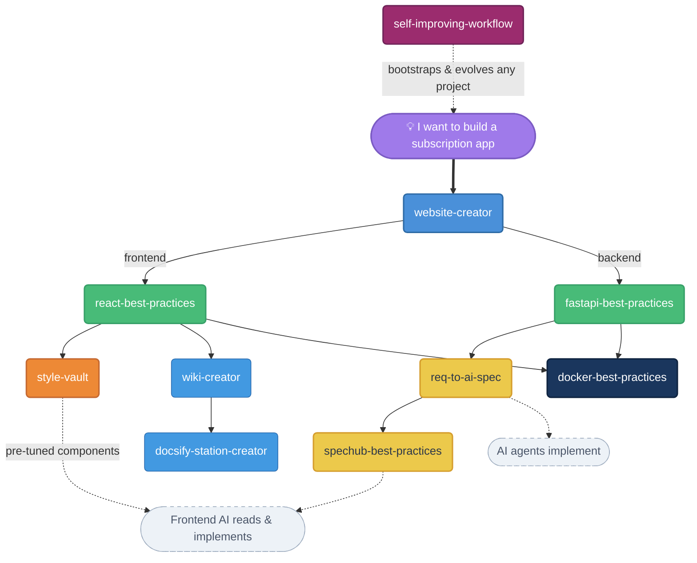

# Awesome Skills

**AI skills for the complete web development lifecycle — from idea to deployed container, and across-team AI collaboration.**

Opinionated skills for Claude Code that encode real-world experience into reusable AI workflows. Describe your idea in plain language; the skills handle architecture decisions, boilerplate, conventions, and deployment — so you ship faster without cutting corners.

> 中文版：[README.zh-CN.md](README.zh-CN.md)

---

## Why This Exists

When you ask an AI to "create a React project" or "write a Dockerfile," you get generic output. These skills give your AI a specific, opinionated point of view — one that comes from production apps, not documentation examples.

- **Conventions are pre-decided.** No more choosing between 10 folder structures.
- **Patterns are battle-tested.** User auth, pagination, SSE streaming, multi-arch images — all included.
- **Skills compose.** Use them independently or chain them to take a project from zero to deployed.

---

## The Workflow



Each skill works standalone. Together, they cover the full lifecycle — from requirements analysis through cross-team AI collaboration to deployment.

---

## Skills

### [`self-improving-workflow`](self-improving-workflow/)

**Universal methodology skill. Two pillars: multi-agent collaborative learning + long-running uninterrupted execution.**

Tech-stack agnostic, project agnostic, no tier system. Drives any project's `.claude/` workflow through a single `/run` entrypoint that plans, executes, reviews, and learns autonomously until done.

- **Pillar 1 — Multi-agent learning** — Four reviewer sub-agents (`planner-critic`, `implementation-reviewer`, `requirement-auditor`, `integration-checker`) hooked at plan/task/slice/phase boundaries. Findings auto-crystallize into `dev-lessons.md` at threshold (≥3 occurrences, ≥0.7 confidence)
- **Pillar 2 — Long-running execution** — `/run <topic>` drives a hierarchical plan (phase→slice→task, hard limits 4×5×7) to completion. Halts only on physically irreversible operations or 3 consecutive review fails
- **Decision log** — `.claude/state/decisions.jsonl` records every non-trivial choice for post-hoc audit
- **Hard reviewer contracts** — Strict JSON output schema + verdict-vs-finding consistency invariants prevent reviewers from silently dropping coverage gaps or seam findings
- **Non-destructive bootstrap** — `init.sh` is idempotent and write-once; existing CLAUDE.md, rules, and any local edits to commands/agents are never overwritten

**Two-step usage** (one-time per project, then everyday):

```
# Step 1 (one time per project) — invoke the skill by name to install
# the slash commands and reviewer subagents into .claude/
/self-improving-workflow

# Step 2 — drive real work
/run add Google login to this project     # full closed loop
/plan refactor the auth module             # plan only
/resume                                    # continue an unfinished plan
/review                                    # diagnostic, read-only
/learn                                     # manual crystallization
```

Step 1 is the bootstrap: it mirrors `commands/` and `agents/` from the skill into the project's `.claude/` (Claude Code only discovers slash commands and subagents from there) and seeds `state/`, `memory/`, and the autonomy-stops rule. Step 2 is where the real value lives — `/run` plans, executes, reviews, and crystallizes lessons fully autonomously.

---

### [`website-creator`](website-creator/)

**Turn a product idea into a scaffolded project through structured conversation.**

Asks 3 fixed questions (name, type, directory) then up to 5 rounds of Socratic follow-up — reaching 95% requirement certainty before generating a single file. Outputs a structured plan for your approval, then invokes `react-best-practices` and/or `fastapi-best-practices` to build the skeleton. Frontend-only or full-stack. Single git repo at the root. User authentication always included in full-stack projects.

```
"I want to build a SaaS platform for team task management"
→ clarifying questions → plan confirmation → project scaffolded
```

---

### [`react-best-practices`](react-best-practices/)

**A complete React development system: scaffold, guide, review.**

Stack: `yarn + Vite + TypeScript + React 19 + Ant Design + Tailwind CSS`

- **Init** — Creates project with full linting toolchain: ESLint, Prettier, Stylelint, Commitlint, Husky, ls-lint, lint-staged. 9 config templates + 7 source templates.
- **Guide** — Layered conventions for pages, components, hooks, services, types. Two-layer loading pattern (Suspense full-screen + in-page Spin). Snake→camelCase API auto-conversion via humps.
- **Review** — Checklist covering structure, naming, code quality, config consistency.

Supports two project scales: simple (static routes) and complex (`import.meta.glob` dynamic route discovery).

---

### [`fastapi-best-practices`](fastapi-best-practices/)

**A complete FastAPI development system: scaffold, guide, review.**

Stack: `FastAPI + uv + SQLAlchemy + Alembic + Pydantic v2`

- **Init** — uv workspace setup, ruff formatting, Alembic migration config, `run.sh` launcher.
- **Guide** — GET/POST only (no PUT/DELETE/PATCH), `Result[T]` response wrapper, MVC layering, token-based user auth (auth_util / oauth / AuthWhitelist), `CustomException` with global handler, `PageParams`/`PageResult[T]` pagination, CORS, `server_default` Beijing-time timestamps, no physical foreign keys (logical FK only).
- **Review** — Auth, DB schema, Pydantic schema, security checklists.
- **Optional patterns** — `convert_util`, `time_util`, `request_context_util`, `crypto_util` (AES-256-GCM).

Supports single-package and UV workspace multi-package architectures with dynamic router auto-discovery.

---

### [`docker-best-practices`](docker-best-practices/)

**Containerize any project: generate, test locally, push multi-arch, deploy to production.**

Scans your project automatically (full-stack / backend-only / frontend-only), asks only what it can't infer, then generates the complete `docker/` directory in one shot.

Output files:

| File | Purpose |
|------|---------|
| `Dockerfile` | Multi-stage build (frontend builder → backend deps → runtime) |
| `entrypoint.sh` | Startup orchestration with embedded MariaDB toggle |
| `nginx.conf` | Reverse proxy with SSE streaming + WebSocket support |
| `docker-compose.yml` | Local test (build-based) |
| `docker-compose.prod.yml` | Production deploy (image-based) |
| `DEPLOY.md` | Full build + deploy documentation for the project |
| `.dockerignore` | Minimized image size |

Embedded MariaDB dual-mode: single image supports both `USE_EMBEDDED_DB=true` (self-contained) and `false` (external MySQL) via env var. Multi-arch `buildx` push to private registry or Docker Hub.

---

### [`wiki-creator`](wiki-creator/)

**Deep-scan a codebase and generate structured, DeepWiki-style documentation.**

Follows import chains from entry files, reads actual source code (not just file names), and generates 4–10 Markdown files tailored to your project's actual characteristics. Includes Mermaid architecture diagrams with render-safe styling. Pairs with `docsify-station-creator` to turn the output into a browsable site.

---

### [`docsify-station-creator`](docsify-station-creator/)

**Turn any `docs/` folder into a fully-featured documentation site.**

Dark/light theme toggle, right-side TOC with scroll highlight, full-text search, Mermaid + Panzoom, syntax highlighting for 16 languages, responsive layout. Cross-platform startup scripts included.

---

### [`req-to-ai-spec`](req-to-ai-spec/)

**Turn scattered product requirements into structured, AI-ready specification documents.**

Takes informal inputs — chat logs, product notes, Axure/Figma screenshots, existing codebases — and produces a structured spec that any AI coding agent can implement without ambiguity.

- **Multi-source input** — Text descriptions, prototype screenshots, existing code patterns. Explores the codebase to understand conventions and data models.
- **Structured output** — Generates `YYYY-MM-DD-<slug>-spec.md` with terminology, global constraints, and implementation tasks with acceptance criteria.
- **Pairs with spechub-best-practices** — `req-to-ai-spec` produces the initial spec; `spechub-best-practices` manages its distribution and incremental updates across teams.

```
"Convert these product notes into an AI spec"   → structured spec document
"Analyze these screenshots and generate tasks"   → implementation-ready tasks
```

---

### [`spechub-best-practices`](spechub-best-practices/)

**Write high-quality spec documents for AI-to-AI collaboration, managed via git worktree.**

When Developer A's AI finishes backend work and Developer B's AI needs to pick up frontend implementation, the handoff spec is the *only* communication channel between them. This skill ensures specs are unambiguous, complete, and optimized for AI consumption.

- **Universal framework** — Design principles, file structure (README + CHANGELOG + overview + details), incremental update workflow via CHANGELOG-driven reads.
- **Template library** — Category-specific templates (currently: API integration). Extensible for future task types.
- **Git worktree workflow** — Multi-project spec management via `git worktree`, auto-detection of SpecHub repos, structured commit messages.

```
"Write API spec for the ADOS module"        → generates 4 files following the template
"Update the spec, added a new endpoint"     → updates docs + CHANGELOG entry
"Check out the ados specs"                  → git worktree add specs/ados feature/ados
```

---

### [`solution-vault`](solution-vault/)

**Personal solution library — replicate proven technical solutions across projects.**

A growing collection of battle-tested, complete technical solutions. When you encounter a familiar requirement (OAuth login, file upload, payment integration), pull from your validated solution library instead of building from scratch. Each solution is a self-contained directory with README, template code files, migration scripts, and configuration guides.

- **Categorized** — Solutions organized by domain: `auth/`, `ui/`, `data/`, `integration/`, `infra/`
- **Complete** — Each solution includes backend service, routes, DTOs, frontend components, migrations, and config docs
- **Adaptable** — Template code uses `# ADAPT:` markers for project-specific customization; Claude reads the solution and auto-adapts to your current project's stack and conventions

```
"Give this project Google login"    → reads auth/google-oauth-popup, adapts to your stack
"Save this solution"               → extracts and catalogs the current implementation
```

---

### [`style-vault`](style-vault/)

**Personal frontend component style library — your pre-tuned UI building blocks.**

Stack: `React + Ant Design + Tailwind CSS`

A growing collection of personally refined component styles. Instead of tweaking tables, toolbars, and forms from scratch every project, pull from your validated library of components that already look the way you want.

- **Composites** — Scene-level combinations: admin tables with unified pagination, search toolbars with filter/action layout
- **Atoms** — Individual elements with distinct styling (growing)
- **Tokens** — Global design variables: spacing, colors, typography (growing)

Each component includes complete, copy-paste-ready code with style notes explaining *why*, not just *what*.

---

## Installation

```bash
# Clone the repo
git clone https://github.com/garveyhu/awesome-skills.git

# Copy all skills into Claude Code's skill directory
cp -r awesome-skills/*/  ~/.claude/skills/
```

Each skill is self-contained. To install only specific skills, copy individual folders instead:

```bash
cp -r awesome-skills/react-best-practices ~/.claude/skills/
```

---

## Usage

Skills trigger automatically when relevant. Just describe what you want:

```
"Build me a project management SaaS"           → website-creator
"Add a paginated user list page"               → react-best-practices
"Create an order search API with filters"      → fastapi-best-practices
"Dockerize this project and push to my registry" → docker-best-practices
"Generate docs for this codebase"              → wiki-creator
"Turn the docs folder into a site"             → docsify-station-creator
"Convert these product notes into a spec"       → req-to-ai-spec
"Write API spec for frontend integration"      → spechub-best-practices
"Build an admin table matching my style"          → style-vault
"Add Google login to this project"                → solution-vault
"Bootstrap a workflow for this project"           → self-improving-workflow
"Capture lessons from this session"               → self-improving-workflow
```
