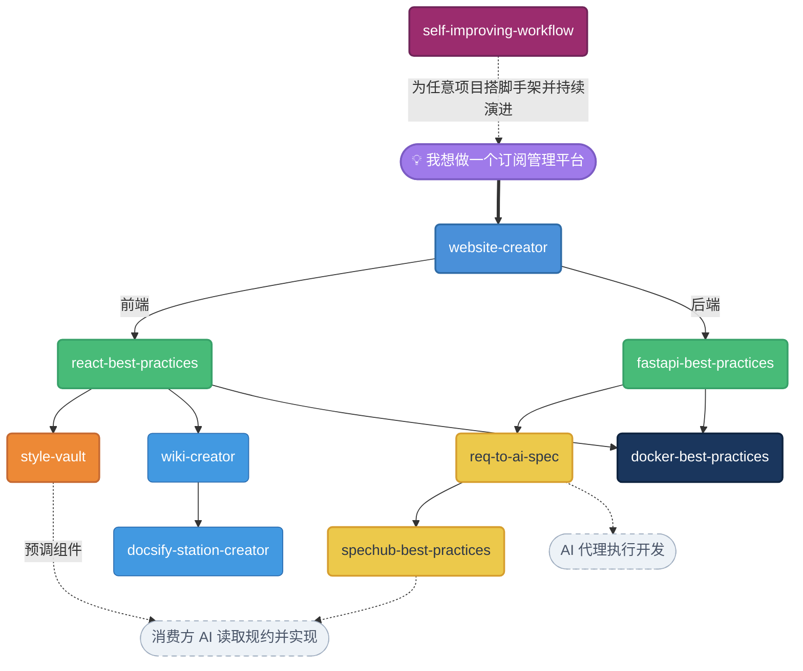

# Awesome Skills

**覆盖 Web 开发完整生命周期的 AI Skill 集合 —— 从想法到上线容器，再到跨团队 AI 协作。**

将实战经验固化为可复用 AI 工作流的 Claude Code Skill 集合。用自然语言描述你的需求，Skill 负责架构决策、样板代码、开发规范和部署流程 —— 更快交付，不走捷径。

> English version: [README.md](README.md)

---

## 为什么要做这个

你让 AI "创建一个 React 项目" 或 "写个 Dockerfile"，得到的往往是通用输出。这些 Skill 给了 AI 一个具体的、有主张的视角 —— 来自真实生产应用，而不是文档示例。

- **规范已预先确定。** 不再纠结于十种目录结构该选哪个。
- **模式经过生产验证。** 用户认证、分页、SSE 流式响应、多架构镜像 —— 全都内置。
- **Skill 可以组合。** 单独使用，或串联起来，从零完成一个项目的完整交付。

---

## 工作流



每个 Skill 都可以单独使用。组合起来，覆盖从需求分析到跨团队 AI 协作再到部署的完整生命周期。

---

## Skill 列表

### [`self-improving-workflow`](self-improving-workflow/)

**通用方法论 skill。两根支柱：多智能体协同学习 + 长任务不间断执行。**

技术栈无关，项目无关，无分档。通过单一 `/run` 入口，自主驱动任意项目的 `.claude/` 工作流——计划、执行、评审、学习直到完成。

- **支柱 1 · 多智能体协同学习** — 4 个评审子代理（`planner-critic`、`implementation-reviewer`、`requirement-auditor`、`integration-checker`）分别 hook 在 plan/task/slice/phase 边界。评审产出经阈值（≥3 次出现 + ≥0.7 置信度）自动晶体化进 `dev-lessons.md`
- **支柱 2 · 长任务不间断执行** — `/run <主题>` 驱动三层 plan（phase→slice→task，硬上限 4×5×7）跑到完成。仅在物理不可逆操作或同一目标连续 3 次评审失败时停下
- **决策日志** — `.claude/state/decisions.jsonl` 记录所有非平凡决策，事后可审计
- **硬性评审契约** — 严格的 JSON 输出 schema + verdict-vs-finding 一致性不变量，避免评审默默丢掉 coverage gap 或 seam
- **非破坏性 bootstrap** — `init.sh` 幂等且按文件 write-once；已有的 CLAUDE.md、rules、以及任何对 commands/agents 的本地修改都不会被覆盖

**两步上手**（每个项目一次性 + 日常使用）：

```
# 第 1 步（每个项目一次）—— 用 skill 名字调用，触发 bootstrap，
# 把 commands/ 和 agents/ 装进 .claude/
/self-improving-workflow

# 第 2 步 —— 真正驱动工作
/run 给这个项目接入 Google 登录   # 全闭环
/plan 重构 auth 模块               # 仅写 plan
/resume                            # 续跑未完成的 plan
/review                            # 只读诊断
/learn                             # 手动晶体化
```

第 1 步是 bootstrap：把 skill 里的 `commands/` 和 `agents/` 镜像到项目 `.claude/`（Claude Code 只能在这两个目录下发现 slash 命令和 subagent），并种下 `state/`、`memory/`、`rules/autonomy-stops.md`。第 2 步才是真正的价值所在 —— `/run` 全自主完成 plan、执行、评审、晶体化。

---

### [`website-creator`](website-creator/)

**通过结构化对话，将产品想法变成脚手架项目。**

先问 3 个固定问题（名称、类型、目录），再进行最多 5 轮苏格拉底式追问 —— 在 95% 需求确定度之前不生成任何文件。输出结构化规划等你确认，然后调用 `react-best-practices` 和/或 `fastapi-best-practices` 构建骨架。支持纯前端或前后端全栈，单 git 仓库管理。全栈项目始终内置用户认证骨架。

```
"帮我做一个 SaaS 团队任务管理平台"
→ 几轮追问 → 确认规划 → 项目骨架生成完毕
```

---

### [`react-best-practices`](react-best-practices/)

**完整的 React 开发体系：初始化、开发指导、代码审查。**

技术栈：`yarn + Vite + TypeScript + React 19 + Ant Design + Tailwind CSS`

- **Init** — 创建项目并配置完整代码规范工具链：ESLint、Prettier、Stylelint、Commitlint、Husky、ls-lint、lint-staged。包含 9 份配置模板 + 7 份源码模板。
- **Guide** — 页面、组件、Hook、服务、类型的分层规范。两层 Loading 模式（Suspense 全屏 + 页面内 Spin）。通过 humps 自动转换 snake_case API 字段。
- **Review** — 覆盖结构、命名、代码质量、配置一致性的检查清单。

支持简单项目（静态路由）和复杂项目（`import.meta.glob` 动态路由发现）两种规模。

---

### [`fastapi-best-practices`](fastapi-best-practices/)

**完整的 FastAPI 开发体系：初始化、开发指导、代码审查。**

技术栈：`FastAPI + uv + SQLAlchemy + Alembic + Pydantic v2`

- **Init** — uv workspace 搭建、ruff 格式化、Alembic 迁移配置、`run.sh` 本地启动脚本。
- **Guide** — 仅 GET/POST（禁用 PUT/DELETE/PATCH）、`Result[T]` 响应包装、MVC 分层、用户认证三件套（auth_util / oauth / AuthWhitelist）、`CustomException` 全局处理、`PageParams`/`PageResult[T]` 分页、CORS、`server_default` 北京时间时间戳、禁止物理外键（仅逻辑外键）。
- **Review** — 认证、数据库 Schema、Pydantic Schema、安全检查清单。
- **可选工具模式** — `convert_util`、`time_util`、`request_context_util`、`crypto_util`（AES-256-GCM）。

支持单包项目和 UV workspace 多包架构，含动态路由自动注册。

---

### [`docker-best-practices`](docker-best-practices/)

**容器化任意项目：生成配置、本地测试、多架构推送、生产部署。**

自动扫描项目类型（全栈 / 纯后端 / 纯前端），只问无法推断的信息，一次性生成完整 `docker/` 目录。

输出文件：

| 文件 | 用途 |
|------|------|
| `Dockerfile` | 多阶段构建（前端构建 → 后端依赖 → 运行镜像） |
| `entrypoint.sh` | 启动编排，含嵌入式 MariaDB 双模式切换 |
| `nginx.conf` | 反向代理，含 SSE 流式 + WebSocket 支持 |
| `docker-compose.yml` | 本地测试（build-based） |
| `docker-compose.prod.yml` | 生产部署（image-based） |
| `DEPLOY.md` | 项目专属的构建与部署说明文档 |
| `.dockerignore` | 最小化镜像体积 |

嵌入式 MariaDB 双模式：同一镜像通过 `USE_EMBEDDED_DB=true/false` 切换内置 MariaDB 或外部 MySQL。支持 `buildx` 多架构推送到私有仓库或 Docker Hub。

---

### [`wiki-creator`](wiki-creator/)

**深度扫描代码库，生成 DeepWiki 风格的结构化文档。**

从入口文件出发追踪 import 链，阅读真实源码（而非仅看文件名），根据项目特征灵活生成 4–10 个 Markdown 文件。包含 Mermaid 架构图（含渲染安全样式指南）。与 `docsify-station-creator` 配合，将输出直接变成可浏览的文档站。

---

### [`docsify-station-creator`](docsify-station-creator/)

**将任意 `docs/` 目录一键转为功能完整的文档站。**

深色/浅色主题切换、右侧目录（滚动高亮）、全文搜索、Mermaid + Panzoom 放大、16 种语言代码高亮、响应式布局。含跨平台启动脚本（Windows `.bat` + Unix `.sh`）。

---

### [`req-to-ai-spec`](req-to-ai-spec/)

**将零散的产品需求转化为结构化的、AI 可执行的需求规格文档。**

接受多种输入 —— 聊天记录、产品笔记、Axure/Figma 截图、现有代码库 —— 产出结构化规格文档，任何 AI 编码代理读后即可无歧义地完成开发。

- **多来源输入** — 文字描述、原型截图、现有代码模式。自动探索代码库以理解现有规范和数据模型。
- **结构化输出** — 生成 `YYYY-MM-DD-<slug>-spec.md`，包含术语表、全局约束、带验收标准的实现任务。
- **与 spechub-best-practices 配合** — `req-to-ai-spec` 产出初始规格；`spechub-best-practices` 负责其在团队间的分发和增量更新管理。

```
"把这些产品需求转成 AI 可执行的规格文档"    → 结构化规格文档
"分析这些截图生成开发任务"                 → 带验收标准的实现任务
```

---

### [`spechub-best-practices`](spechub-best-practices/)

**编写高质量规约文档并通过 git worktree 管理，用于不同 AI 助手间的任务交接。**

当 A 同事的 AI 完成后端开发，B 同事的 AI 需要接手前端实现时，交接规约是两个 AI 之间唯一的沟通渠道。这个 Skill 确保规约无歧义、完整、且针对 AI 消费优化。

- **通用规约框架** — 设计原则、文件结构（README + CHANGELOG + 总览 + 详细说明）、CHANGELOG 驱动的增量更新工作流。
- **分类模板库** — 按任务类型提供专用模板（当前支持：API 对接），可扩展。
- **Git worktree 工作流** — 多项目规约通过 `git worktree` 管理，自动识别 SpecHub 仓库，结构化 commit message。

```
"写 ADOS 模块的 API 对接规约"              → 按模板生成 4 个文件
"更新规约，新增了一个接口"                 → 更新文档 + CHANGELOG 条目
"检出 ados 的规约"                        → git worktree add specs/ados feature/ados
```

---

### [`solution-vault`](solution-vault/)

**个人解决方案库 —— 跨项目快速复刻验证过的技术方案。**

不断积累的完整技术方案沉淀。遇到熟悉的需求（OAuth 登录、文件上传、支付集成）时，直接从已验证的方案库中取用，而不是从零开始。每个方案是一个独立目录，包含 README、模板代码、迁移脚本和配置文档。

- **分类组织** — 按领域分类：`auth/`（认证）、`ui/`（交互）、`data/`（数据）、`integration/`（集成）、`infra/`（部署）
- **完整可用** — 每个方案包含后端服务、路由、DTO、前端组件、数据库迁移、配置说明
- **自动适配** — 模板代码用 `# ADAPT:` 标记需适配的部分；Claude 读取方案后自动适配到当前项目的技术栈和规范

```
"给这个项目接入 Google 登录"        → 读取 auth/google-oauth-popup，适配到你的项目
"把这个方案沉淀下来"               → 提取并归档当前实现
```

---

### [`style-vault`](style-vault/)

**个人前端组件样式库 —— 预调好的 UI 积木。**

技术栈：`React + Ant Design + Tailwind CSS`

不断积累的个人组件样式沉淀。不用每个项目都从头调表格、工具栏、表单样式，直接从已经验证过的样式库中取用。

- **场景组合（composites）** — 管理后台表格（统一分页）、搜索工具栏（筛选/按钮布局）
- **原子组件（atoms）** — 有独立风格的单个元素（持续积累中）
- **设计 Token（tokens）** — 间距、配色、字号等全局变量（持续积累中）

每个组件都包含完整可复制的代码，以及解释"为什么这样做"的样式要点。

---

## 安装

```bash
# 克隆仓库
git clone https://github.com/garveyhu/awesome-skills.git

# 一键复制所有 Skill 到 Claude Code 的 skill 目录
cp -r awesome-skills/*/  ~/.claude/skills/
```

每个 Skill 完全自包含。如果只需要部分 Skill，单独复制对应文件夹即可：

```bash
cp -r awesome-skills/react-best-practices ~/.claude/skills/
```

---

## 使用

Skill 在相关场景下自动触发，直接描述你想做的事：

```
"帮我做一个项目管理 SaaS"                  → website-creator
"添加一个用户列表分页页面"                  → react-best-practices
"写一个带过滤条件的订单查询接口"             → fastapi-best-practices
"把这个项目容器化然后推送到我的仓库"          → docker-best-practices
"给这个项目生成文档"                        → wiki-creator
"把 docs 目录做成一个文档站"                → docsify-station-creator
"把这些产品需求转成 AI 规格文档"             → req-to-ai-spec
"写 API 对接规约给前端"                     → spechub-best-practices
"用我的风格做一个管理后台表格"                → style-vault
"给这个项目接入 Google 登录"                  → solution-vault
"给这个项目搭一套工作流"                      → self-improving-workflow
"沉淀本次会话的教训"                          → self-improving-workflow
```
