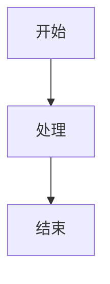

# Docsify 自定义指南

> 站点文件都在 `docs/docsify/`，下文的 `index.html` 均指 `docs/docsify/index.html`。

## 修改主题色（强调色）

读者可直接在站内用**左下角齿轮 → 设置面板 → 强调色**切换（5 套预设，持久化）。若要改默认/品牌色，编辑 `docs/docsify/index.html` 里的强调色预设：

```css
/* 默认强调色（:root）—— 改成你的品牌色起头，渐变会以它为主推导 */
:root { --a1: #2b8fd6; --a2: #5468ee; --a3: #6d5cf0; }
/* 其余预设：html[data-accent='ocean'|'forest'|'sunset'|'mono'] { --a1/--a2/--a3 } */
```

`--theme-color` 已接管为 `var(--accent)`，正文链接 / 选中态会自动跟随强调色。

## 项目图标（favicon）

favicon 是内置的**墨黑底 + 白色线稿书**标记（纯色、无渐变、无 emoji，符合克制 emoji 原则，且不依赖主题色，换任何强调色都不冲突）。如需换色，编辑 `docs/docsify/index.html` 里 favicon SVG 的 `fill`（底色 `%231e293b`）与 `stroke`（线稿 `%23ffffff`）。**不要换回纯色块或 emoji favicon。**

## 添加代码语言高亮

已内置语言（模板默认全部加载，与 cdn 仓库 `libs/prism/components/` 一致）：
`bash` · `yaml` · `json` · `json5` · `javascript` · `typescript` · `jsx` · `tsx` · `css` · `scss` · `python` · `java` · `kotlin` · `go` · `rust` · `sql` · `docker` · `markdown`。`html`/`xml` 等 markup 已在 Prism 核心内置，无需单独加载。

需要别的语言时（资源走自托管仓库 `cdn.archeruuu.com/libs`，不用 CDN）两步：
1. 把语言组件放进 cdn 仓库 `libs/prism/components/prism-[语言].min.js` 并 `git push`（Pages 自动更新）。
2. 在 `docs/docsify/index.html` 的 `<!-- 代码高亮 -->` 部分加一行（注意 Prism 依赖顺序，如 `tsx` 要在 `jsx`/`typescript` 之后）：

```html
<script src="https://cdn.archeruuu.com/libs/prism/components/prism-[语言].min.js"></script>
```

## Markdown 编写规范

### 标题层级

- `# 一级标题`：每个页面只用一次，作为页面标题
- `## 二级标题`：主要章节
- `### 三级标题`：子章节
- `#### 四级标题`：详细说明

### Mermaid 图表

````markdown

````

### 代码块

添加语言标识以启用语法高亮：

````markdown
```javascript
const hello = "world";
```
````

### 提示框 callout

支持 GitHub 风格的 `> [!TYPE]` 提示框，会自动渲染成带标题的彩色块（NOTE 蓝 / TIP 绿 / IMPORTANT 主题色 / WARNING 琥珀 / CAUTION 红）：

```markdown
> [!NOTE]
> 补充说明，读者可留意。

> [!WARNING]
> 易踩的坑，操作前先读。
```

可用类型：`NOTE` `TIP` `IMPORTANT` `WARNING` `CAUTION`。普通 `>` 引用仍按引用样式渲染，不受影响。

### 数学公式（KaTeX）

支持 LaTeX 公式，由自托管的 KaTeX（`cdn.archeruuu.com/libs/katex`）+ docsify-katex 渲染，不依赖外部 CDN：

```markdown
行内：$E = mc^2$、$\sqrt{d_k}$。
块级：
$$ \text{Attention}(Q,K,V) = \text{softmax}\!\left(\frac{QK^\top}{\sqrt{d_k}}\right) V $$
```

`$...$` 行内、`$$...$$` 块级。新增其它公式无需改动；如需升级 KaTeX，更新 cdn 仓库 `libs/katex/`（含 `fonts/`）即可。

### 中文加粗（自动修复）

marked 对「中文标点紧贴 `**` 紧贴 ASCII 标点」（如 `转型：**"…"**`）不识别加粗。站点已内置 `beforeEach` 修复，渲染前在交界处插入发丝空格，正常书写即可、无需规避。

### Mermaid / 图片全屏预览

点击 Mermaid 图（或正文图片）打开全屏预览：**打开即居中适配屏幕**；工具栏支持缩小 / 适配 / 放大 / 关闭；滚轮缩放、拖拽平移、双击适配、键盘 `+ / - / 0 / Esc`。
