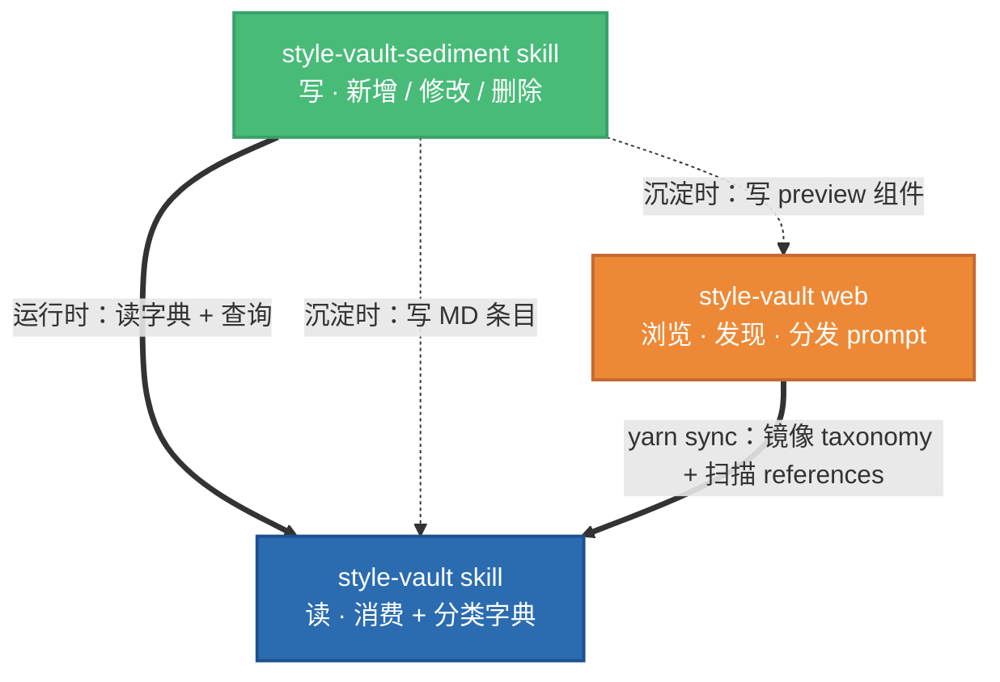

# style-vault-sediment skill

**个人风格资产库 · 写侧** · 新增 / 修改 / 删除风格资产的完整工作流。

这是 style-vault 三件套中的**写 skill**——**只有创作者 / 社区维护者需要装**。普通消费者用网站 + [`style-vault`](../style-vault/) 读 skill 即可。

读操作（消费资产、查分类字典）走兄弟 skill [`style-vault`](../style-vault/)。本 skill 只负责写。

---

## 三件套架构



| 项目 | 位置 | 作用 |
|---|---|---|
| **style-vault skill** | `~/.agents/skills/style-vault/` | AI 消费风格 + 查询分类字典 |
| **style-vault-sediment skill**（本仓） | `~/.agents/skills/style-vault-sediment/` | AI 沉淀 / 修改 / 删除风格 |
| **style-vault web** | `~/Coding/Archer/style-vault/` | 浏览网站 + prompt 卡片分发 |

---

## 本 skill 做什么

把风格**沉淀**到 style-vault——覆盖风格资产的完整生命周期：

### 三种操作模式（由触发语自动路由）

| 用户说… | 走的路径 |
|---|---|
| "沉淀" / "加到 vault" / `/style-vault-sediment` | **默认 create**（新增） |
| "修改 `<id>`" / "改 `<id>` 的 tag" | `modify-workflow` |
| "删除 `<id>`" / "下掉 `<id>`" | `delete-workflow` |

### Create 的四种起点

默认 create 会先问用户沉淀的起点：

```
1) 本地项目路径（扫项目反向归类到六层资产）
2) 在线资源（URL / 截图 / 设计稿，视觉分析重写）
3) 从零创作（有想法，对话式迭代到落地）
4) 其他 / 不确定
```

全流程见 [SKILL.md](SKILL.md) 和 [references/shared-workflow.md](references/shared-workflow.md)。

---

## 核心工作流（shared-workflow 8 步）

所有路径（create / modify / delete）都汇入同一条 8 步主干：

```
1. 加载分类字典         （调 taxonomy.py overview）
2. 授权 auto-fill       （Y / N / 逐条决定）
3. 生成完整写入方案     （拓扑序 + frontmatter + 正文骨架）
4. 整批 review          （用户确认后 plan.md 落盘）
5. path.json 分叉        （VAULT_OK 判定 + 并发锁）
6. 逐条写入             （skill 仓 + 网站仓，每条跑 yarn sync）
7. 网站仓 commit         （若 VAULT_OK=true）
8. 沉淀报告 + skill 仓聚合 commit
```

## 硬约束

- **写入前必须整批 review**——用户确认后才落盘
- **AI 自动填元信息需一次性授权**（Y/N/逐条决定）
- **双仓独立 commit**，不 push，由用户手动
- **新 tag / category 必须先改 taxonomy.json 再写条目**
- **每次沉淀产生报告**，落盘到 `assets/sediment-history/<author>/<date-topic>/`

---

## 目录结构

```
style-vault-sediment/
├── SKILL.md                              入口路由（按触发语分发）
├── README.md                             本文件
├── references/
│   ├── README.md                         workflow 索引
│   ├── shared-workflow.md                共享 8 步主干
│   ├── sediment-from-project.md          Create 起点 1：本地项目
│   ├── sediment-from-web.md              Create 起点 2：在线资源
│   ├── sediment-from-scratch.md          Create 起点 3：从零创作
│   ├── sediment-from-other.md            Create 起点 4：兜底路由
│   ├── modify-workflow.md                修改已有条目
│   └── delete-workflow.md                删除已有（含 cascade）
├── assets/
│   └── sediment-history/                 沉淀历史（按作者分目录）
│       ├── .author-config.example.json
│       ├── .gitignore                    忽略真实 .author-config.json
│       └── <author-slug>/
│           └── YYYY-MM-DD-<topic>/
│               ├── plan.md               沉淀计划
│               ├── report.md             沉淀报告
│               └── source.md (可选)       原始素材溯源
└── scripts/                              预留（未来可能加工具）
```

---

## 沉淀历史的价值

每次沉淀都会在 `assets/sediment-history/` 留下三种文件（视情况）：

- **plan.md** —— 步骤 4 用户确认方案后落盘，即使后续写入失败也保留
- **report.md** —— 步骤 8 落盘，记录实际写入了什么、元信息怎么来的
- **source.md** —— from-web / from-project 才有，溯源 URL / 截图 / 项目路径

按 **作者 slug + 日期 + 主题** 分目录——未来支持社区多人维护时，每人一个文件夹不冲突。

查询历史：`taxonomy.py history`（归在读侧 skill 里），见 [../style-vault/](../style-vault/)。

---

## 与其它两件的关系

### 硬依赖 `style-vault` skill

运行时**每次沉淀都会**：
- 读 `../style-vault/assets/taxonomy.json` 做分类合法性校验
- 调 `../style-vault/scripts/taxonomy.py` 查 id / 反向引用（删除前依赖检查）

两 skill **必须成对安装**。

### 按需写入 `style-vault web`

沉淀时判断 `~/.agents/path.json` + 网站仓 marker，成立则：
- 写 `frontend/src/preview/<id>.tsx`
- 跑 `cd $VAULT/frontend && yarn sync` 做校验
- 双仓独立 commit

不成立（`VAULT_OK=false`）时走 **skill-only 沉淀**——只写 skill 仓，不动网站。

---

## 相关链接

- [SKILL.md](SKILL.md) · 入口路由表
- [references/shared-workflow.md](references/shared-workflow.md) · 8 步主干
- [references/README.md](references/README.md) · workflow 索引
- 兄弟 skill：[style-vault](../style-vault/)
- 网站仓：`~/Coding/Archer/style-vault/`
